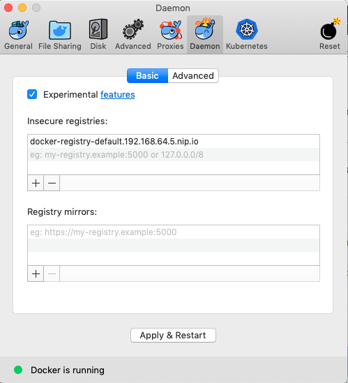
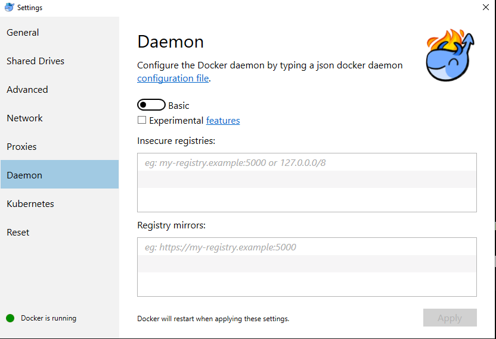
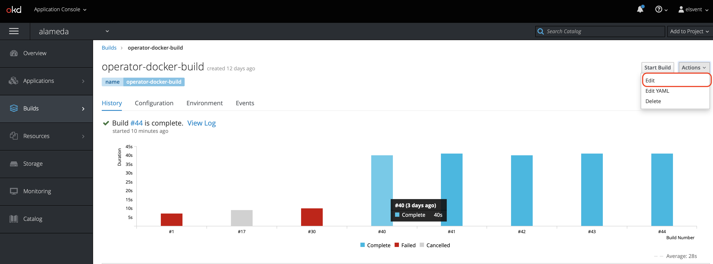
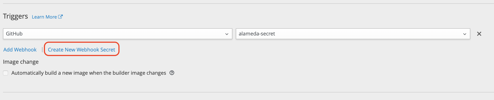

In this document, you can find the guides to deploy develop environment with Minishift and OpenShift.
- [with Minishift](#use-minishift-for-local-development-environment)
- [with Openshift](#deploy-alameda-alameda-ai-on-okd-cluster)

# Use Minishit for local development environment

---

## Pre-requirement

#### Hypervisor Choice

**Mac**: xhyve

**linux**: KVM

**windows**: hyper-v if using windows pro

**all platform support**:virtualbox

#### Setup virtual environment
Setup for each platform details please reference openshit document

https://docs.okd.io/latest/minishift/getting-started/setting-up-virtualization-environment.html

#### Install minishift

Install minishift please reference openshift document for each platform:

https://docs.okd.io/latest/minishift/getting-started/installing.html

## Setup Developer Environment

Execute below command to start minishift
```
minishift start
```

After install execute below command to use oc command
```
eval $(minishift oc-env)
```
To access web console
```
minishift console
```

## Setup minishift addons

Enable admin addons
```
minishift addons enable admin-user
minishift addons apply admin-user
```

After this login as admin, default password: **password**

```
oc login -u admin
```

Enable registry-route addons

```
minishift addons enable registry-route
minishift addons apply registry-route
```

Minishift registry using self-signed CA certification,
therefore we need add insecure registry for docker login

First execute command
```
minishift openshift registry
```
copy paste address for setting insecure-registries

**Mac**:

Add in docker preference daemon tab



**Windows**

Add in docker preference daemon tab



**linux**

add "insecure-registries" : ["<address\>"] to /etc/docker/daemon.json
than restart docker daemon

## Setup project

Login as developer to create project
```
oc login -u developer
```
Create alameda project
```
oc new-project alameda
```

## Apply yaml for kubernetes config

Login as admin, then apply follow yaml files in example/deployment/openshift

```
oc login -u admin
```
```
oc adm policy add-scc-to-group anyuid system:authenticated
oc apply -f prometheus.yaml
oc apply -f rbac
oc apply -f crds
oc apply -f service
oc apply -f deployconfig
```

Clone code and build docker image for operator and dashboard
```
git clone https://github.com/containers-ai/alameda.git
cd alameda/operator
docker build -t operator .
```
Clone code and build docker image for alameda-ai
```
git clone https://github.com/containers-ai/alameda-ai.git
cd alameda-ai
docker build -t alameda-ai .
```
Tag image and push to minishift registry
```
oc login -u developer
docker tag operator $(minishift openshift registry)/alameda/operator
docker tag alameda-ai $(minishift openshift registry)/alameda/alameda-ai
docker tag dashboard $(minishift openshift registry)/alameda/dashboard
oc whoami -t | docker login -u developer --password-stdin $(minishift openshift registry)
docker push $(minishift openshift registry)/alameda/operator
docker push $(minishift openshift registry)/alameda/alameda-ai
docker push $(minishift openshift registry)/alameda/dashboard
```

Check pod successful created and running
```
oc get pod
```
log in to pod
```
oc exec -it <pod name> bash
```

After ensure both operator and alameda-ai running execute below command
```
cd <alameda>/example/samples/nginx
oc apply -f nginx_deployment.yaml
oc apply -f alameda_deployment.yaml
```
# Deploy alameda/alameda-ai on OKD cluster

## Pre-requirement

1. Setup OKD version 3.11.23 cluster and command line eg: oc, kubectl
2. Configure Prometheus in project openshift-monitoring
3. Create user and setup RBAC policy

## Use Dockerfile build strategy

Login your OKD cluster
```
oc login -u <user> <address>
```

First create project named alameda
```
oc new-project alameda
```

Create imagestream first in registry
```
oc create imagestream alameda-ai
oc create imagestream operator-test
oc create imagestream dashboard
oc create imagestream datahub
```

Apply build config
```
oc apply -f build_config
```

## Setup github webhook
go to application console using edit to add github web hook for each build(operator/alameda-ai)

First **select edit**


Second, click on **show advanced options**


Third, create github web hook via **Create New Webhook Secret**


Than save it
Verify this just commit to github build should trigger automatic


## Apply alameda and alameda-ai deploy config
Grant alameda-ai pod to run container as root user.
```
oc adm policy  add-scc-to-user anyuid system:serviceaccount:alameda:alameda-ai
``` 

Apply following yaml
```
oc apply -f rbac
oc apply -f crds
oc apply -f service
oc apply -f deployconfig
```

Check pod successful created and running

```
oc get pod
```

log in to pod
```
oc exec -it <pod name> bash
```

After ensure both operator and alameda-ai running execute below command
```
cd <alameda>/example/samples/nginx
oc adm policy  add-scc-to-user anyuid system:serviceaccount:webapp:nginx
oc apply -f nginx_deployment.yaml
oc apply -f alamedascaler.yaml
```
